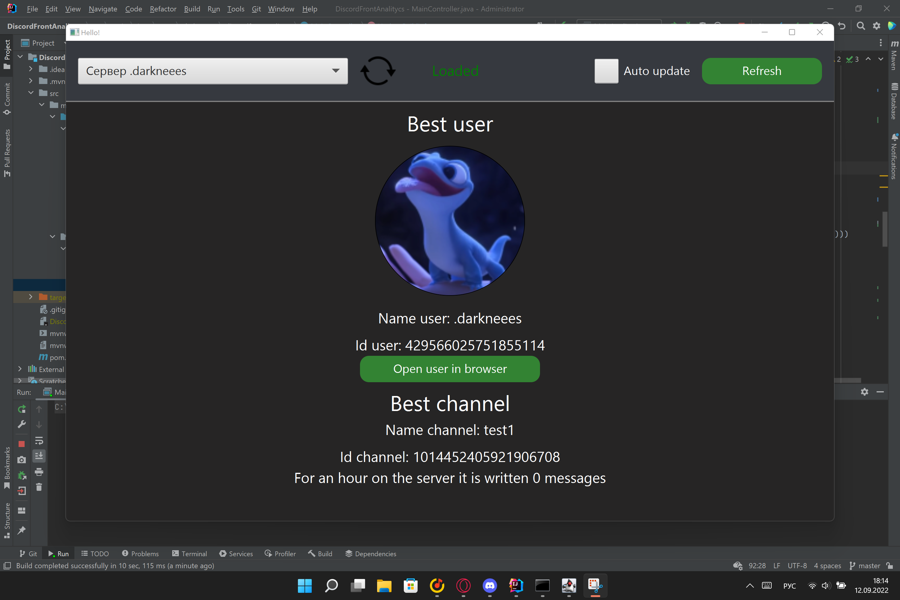

# JavaFXDiscordBotFront - Тестовое задание

## Графическое приложение, которое шлёт запросы на REST-cервис и отображает полученный результат.

Ссылка на github REST-сервиса: [Click](https://github.com/darkneees/BackendBot)

Графические интерфейс:

Через файл application.yml можно настроить адрес, куда будут направляться запросы.
